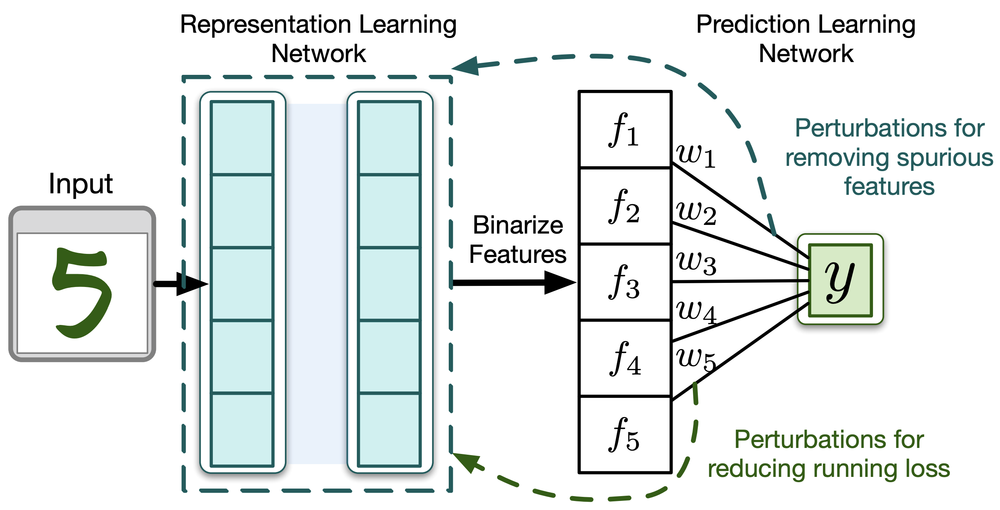

## "Learning Causal Models Online," Khurram Javed, Martha White, Yoshua Bengio 

                                                                          
              

Paper link: https://arxiv.org/abs/2006.07461

Code for representation learning experiments (PwB) and code documentation coming soon. 
